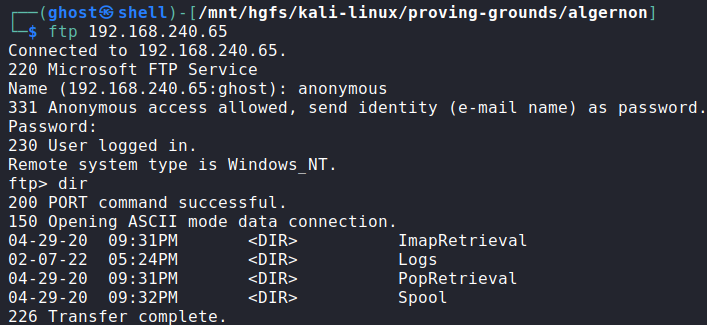
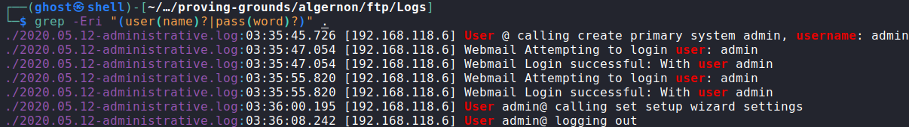
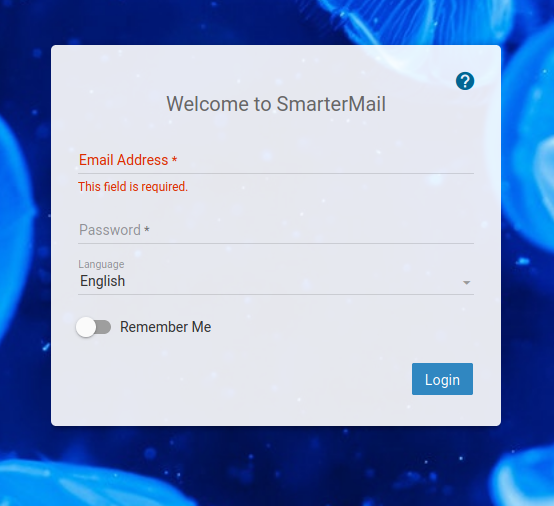
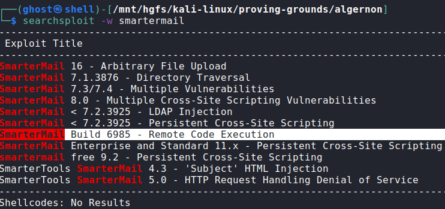
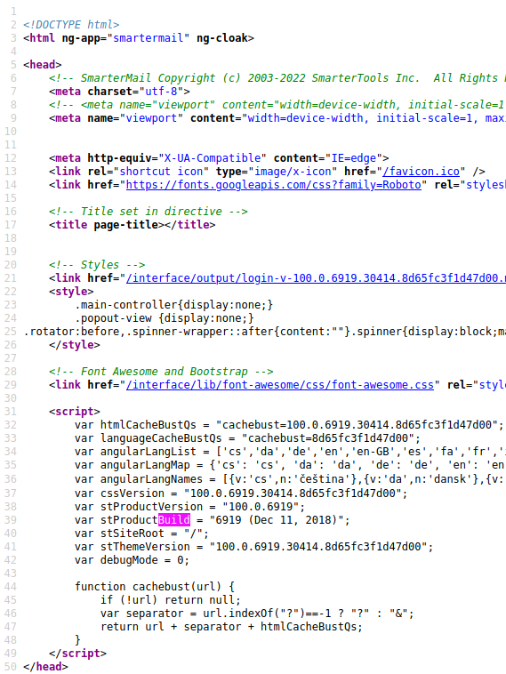
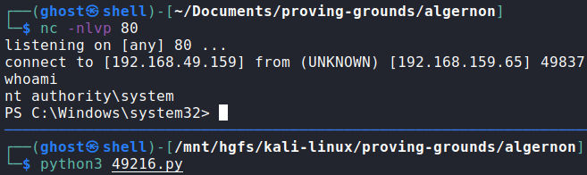
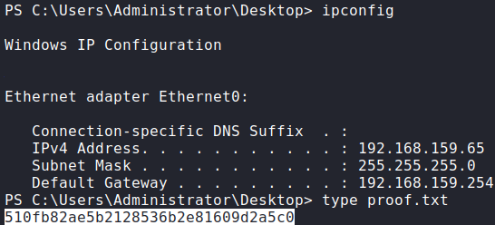

# Algernon

### Port Scan


## Procedure
🔎 Port 21 allows anonymous access.\


🔎 Download all files to search for usernames and passwords.\


🔎 Port 9998 is running a web server with SmarterMail.\


🔎 SmarterMail seems vulnerable to RCE[^1].\


🔎 The build number is below the build required for the exploit (6985).\


💀 Modify and run the exploit to get access as System.
```python
HOST='192.168.159.65'
PORT=17001
LHOST='192.168.49.159'
LPORT=80
```


🏴 Administrator flag.\


### References
[^1]: https://www.exploit-db.com/exploits/49216