# Billy Boss

### Port Scan
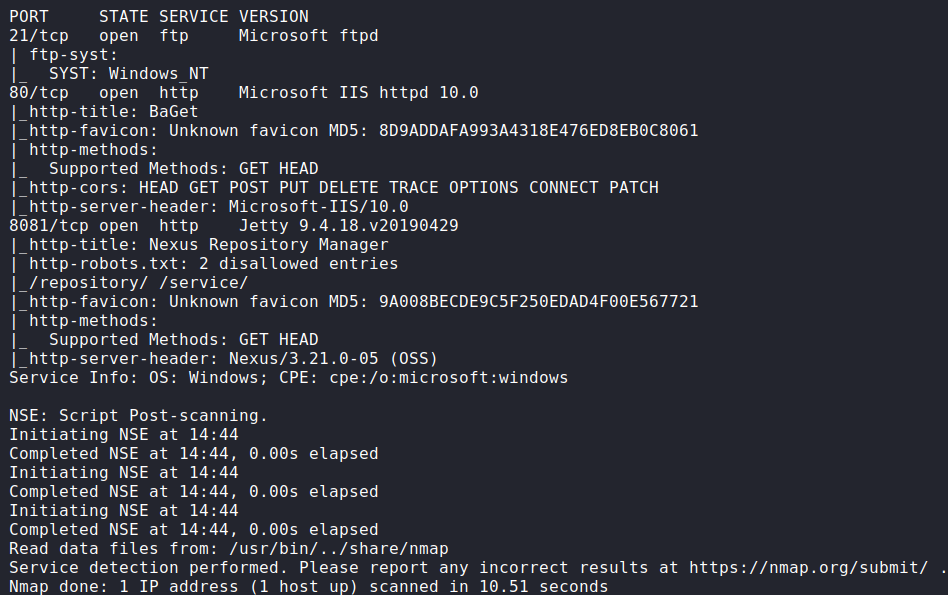

## Procedure
🔎 Port 80 is running BaGet a NuGet and symbol sever.\
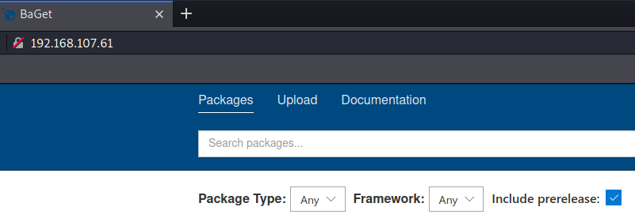

🔎 Port 8081 is running an instance of Nexus v3.21.0-05.\
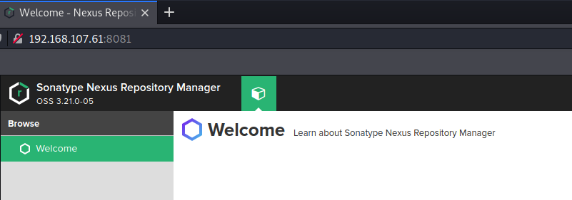

🔎 This version of Nexus seems vulnerable to Remote Code Execution (RCE),
but authentication is required.\
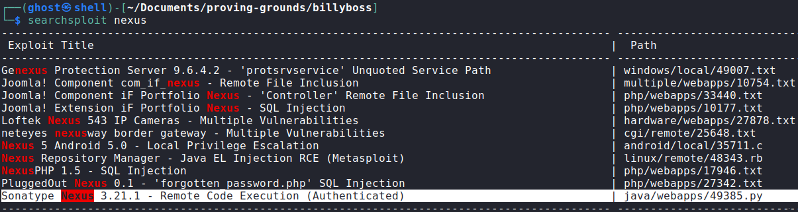

🔑 After several attempts found credentials for Nexus `nexus:nexus`.\
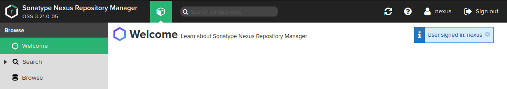

💀 Modify the exploit[^1] to drop a netcat binary and initiate a reverse shell 
to get access as billyboss\\nathan.\
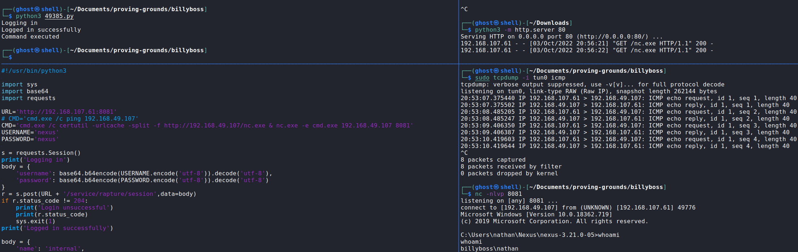

🏳 User flag.\
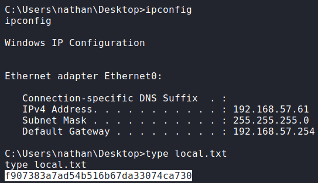

🔎 The user has granted the `SeImpersonatePrivilege` privilege, which means is
possible to elevate privilege via PrintSpoofer[^2].\
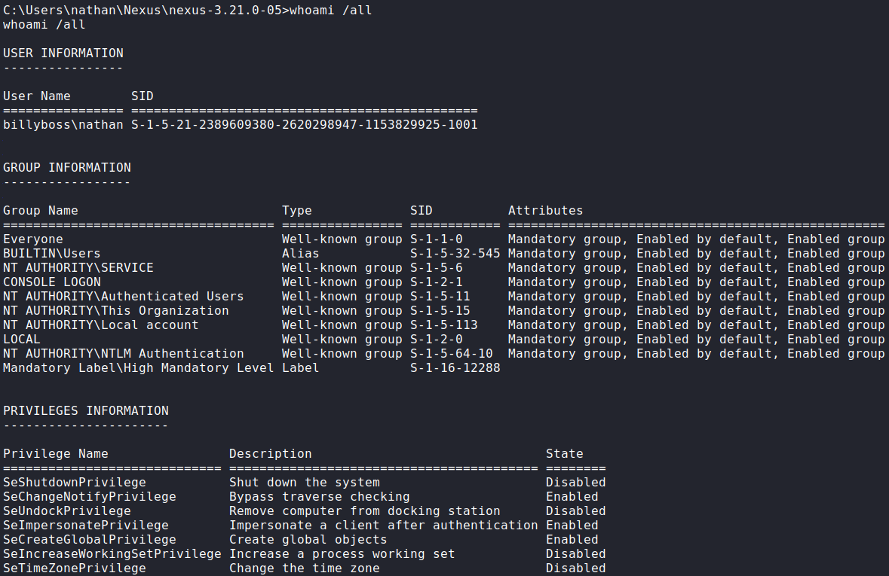

🔎 System information.\
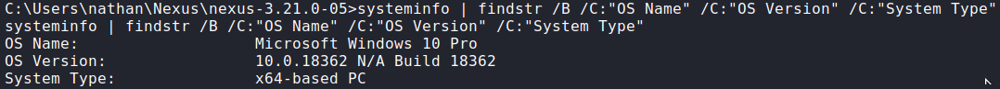

💀 Choose the right binary, with the previous information, and execute the 
exploit[^3] to spawn a new cmd session as System.\
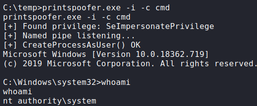

🏴 Administrator flag.\
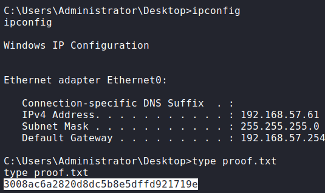

### References
[^1]: https://www.exploit-db.com/exploits/49385
[^2]: https://itm4n.github.io/printspoofer-abusing-impersonate-privileges
[^3]: https://github.com/itm4n/PrintSpoofer