# Craft

### Port Scan

## Procedure
🔎 Port 80 is hosting a generic website.\
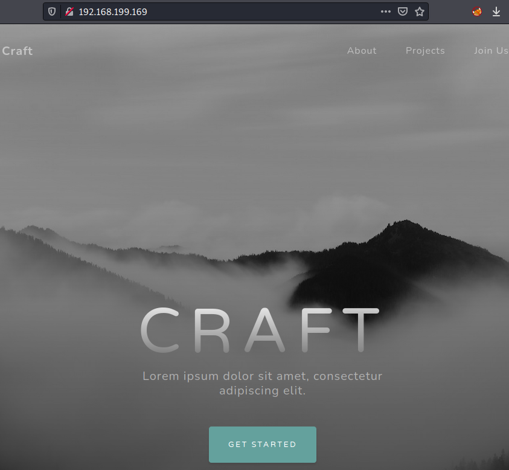

🔎 There is a section to upload files.\

🔎 It only accepts files with `odt` extension.\
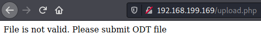

🔑 Retrieved the NTLM hash[^1] of the user `thecybergeek`. Did not find a way to
use it.\
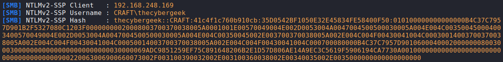

💀 Tried to upload a Netcat binary to spawn a reverse shell without success[^2].
End up using a PowerShell script[^3] with `DownloadString` to avoid writing on
disc.\
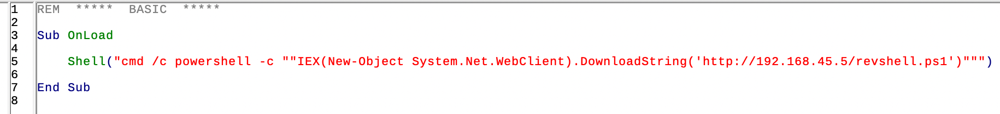
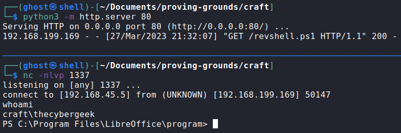

🏳 User flag.\
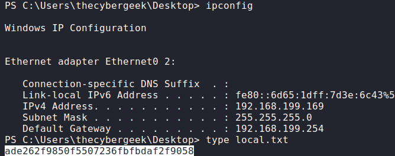

🔎 Groups and privileges of the user `thecybergeek` and system information.
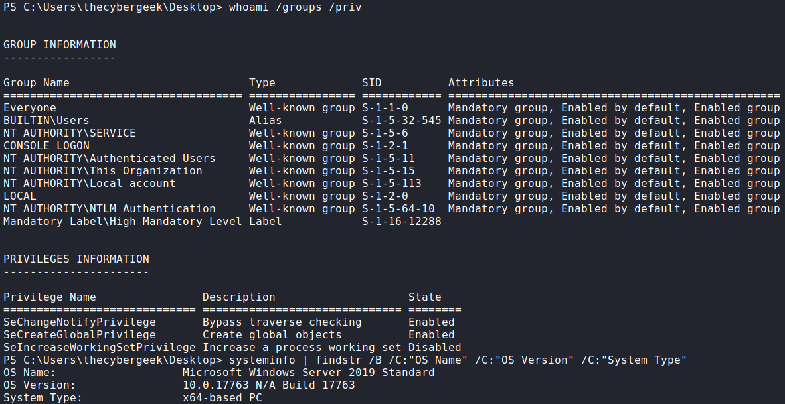

🔎 The service Apache is owned by the user with the same name. Sometimes service
accounts have special privileges.\
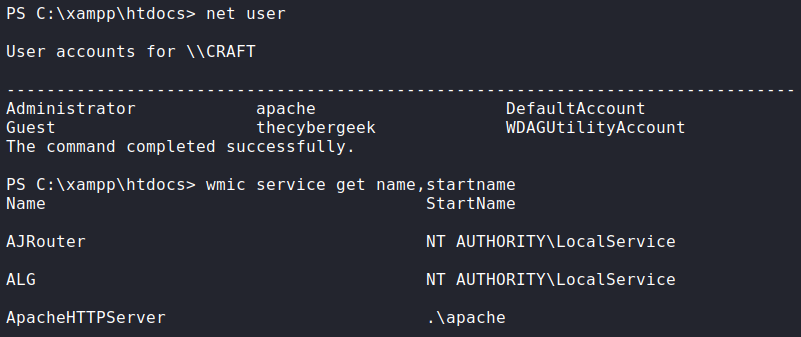

🔎 Uploaded a PHP reverse shell[^4] to the directory where the service is
running.\
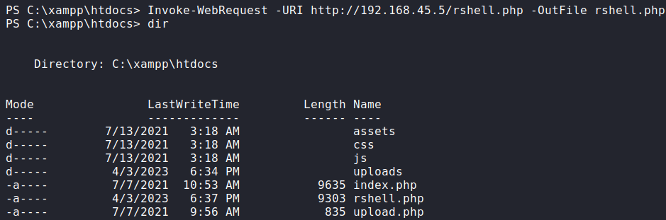

💀 Spawned the shell by visiting `127.0.0.1/rshell.php` from the machine.
Got a session as the user `apache`.\

🔎 The user `apache` has the `SeImpersonatePrivilege` Enabled.\
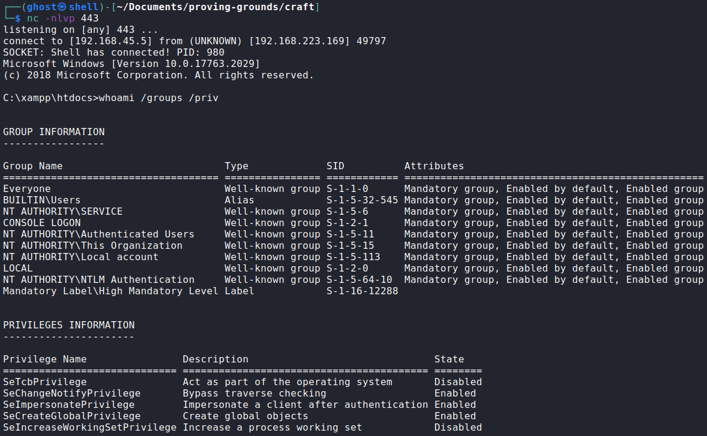

🔎 Uploaded a copy of Juicy Potato[^5] but was unable to make it work since the
machine is a MS Windows Server 2019.\
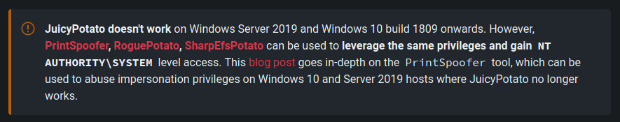

💀 It was still possible to exploit the user's privilege via PrintSpoofer[^6].
Got a session as System.\
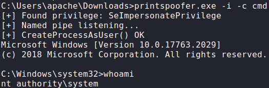

🏴 Administrator flag.\
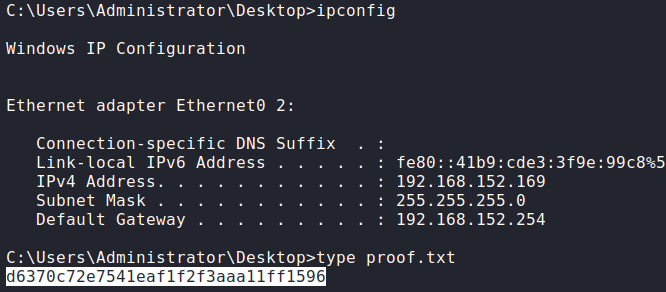

### References
[^1]: https://secureyourit.co.uk/wp/2018/05/01/creating-malicious-odt-files
[^2]: https://github.com/dyloot43/ods/blob/master/odf.xml
[^3]: https://gist.githubusercontent.com/egre55/c058744a4240af6515eb32b2d33fbed3/raw/3ad91872713d60888dca95850c3f6e706231cb40/powershell_reverse_shell.ps1
[^4]: https://github.com/ivan-sincek/php-reverse-shell#reverse-shells
[^5]: https://github.com/k4sth4/Juicy-Potato
[^6]: https://github.com/itm4n/PrintSpoofer