# DVR4

### Port Scan
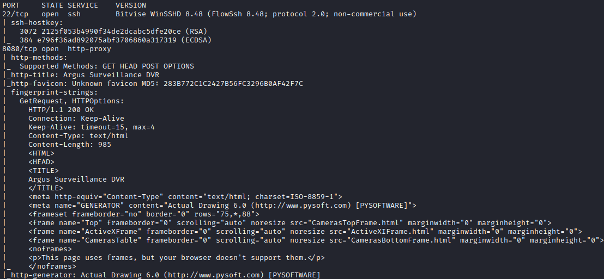

## Procedure
🔎 Port 8080 is hosting an instance of Argus
Surveillance.\
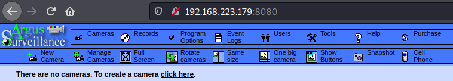

🔎 Found two potential users, **Administrator** and **Viewer**.\
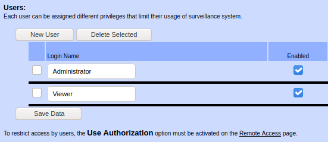

🔎 Argus may be vulnerable to path traversal (CVE-2018-15745).\
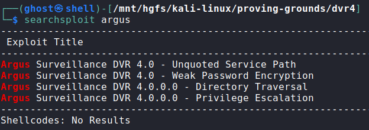

🔎 Testing if the file `Windows\system.ini` is reachable.\
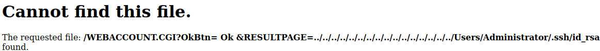

🔑 Could not get the Administrator's SSH key but found the key of the user
Viewer[^1].\
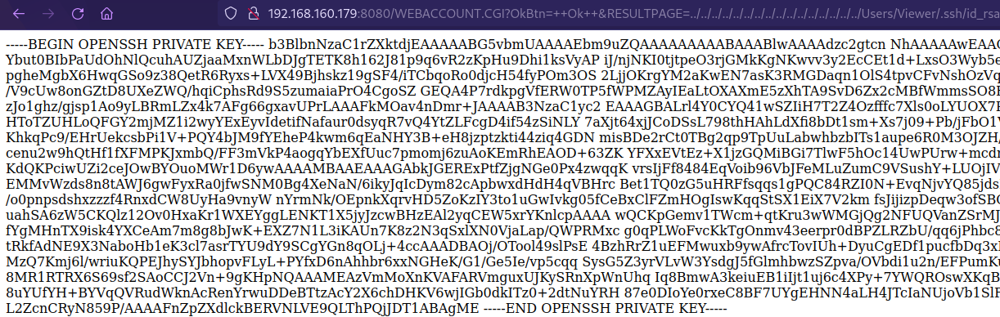

🔎 Accessing the machine as Viewer.\
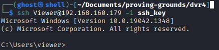

🏳 User flag.\

🔎 User groups and privileges.\
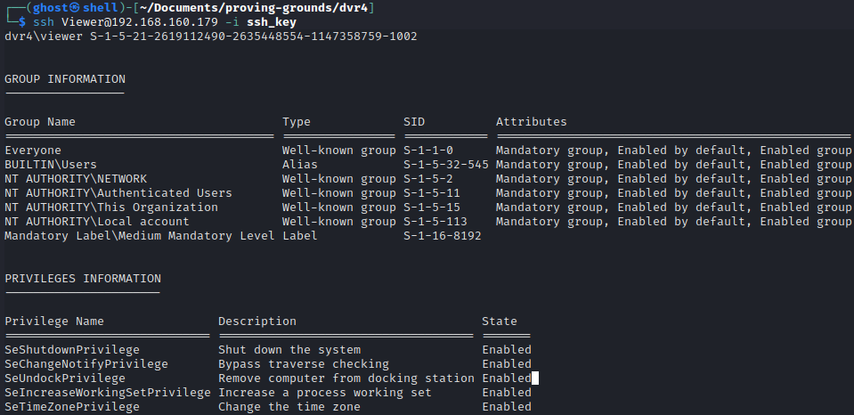

🔎 Searchploit results showed that Argus could be vulnerable to Privilege
Escalation. Checking if it's possible to write in the current directory.\
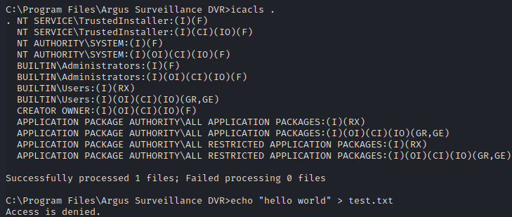

🔎 Found the encrypted Administrator password in the `DVRParams.ini` file.\
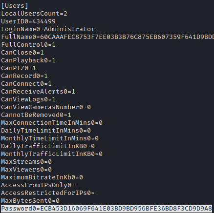

🔑 Searchploit also indicated a Weak Password Encryption vulnerability in Argus
(CVE-2022-25012). Cracking the Administrator password[^2].\
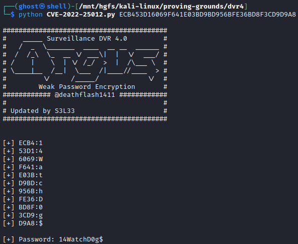

🔎 Uploading an instance of Netcat.\
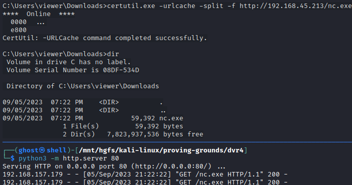

🔎 Spawning a reverse shell using `runas` and getting access as Administrator.\
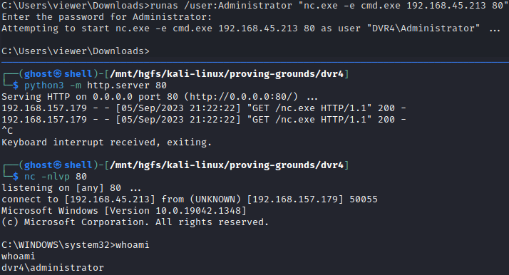

🏴 Admin flag.\
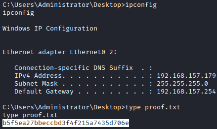

### References
[^1]: https://www.bitvise.com/wug-publickey
[^2]: https://github.com/s3l33/CVE-2022-25012/blob/main/CVE-2022-25012.py