# Hutch

### Port Scan
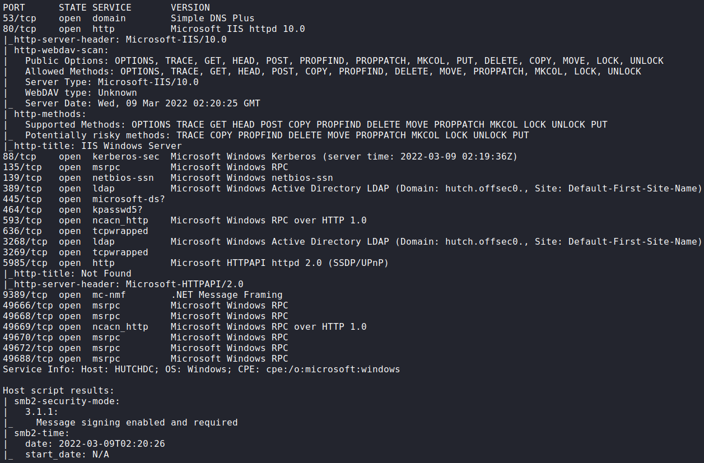

## Procedure
🔎 Port 88 (Kerberos) indicates that the server is probably an Active Directory
Domain Controller ADDC.

🔎 Port 135 and 445 allows anonymous sessions but no shares are available.

🔎 Port 80 is running an IIS server 10.0 with WebDav enabled.\
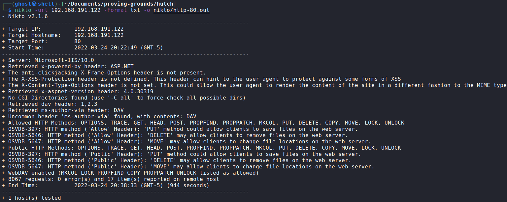

🔎 Port 389 is using LDAP, looking up the machine's hostname and additional
entries.\
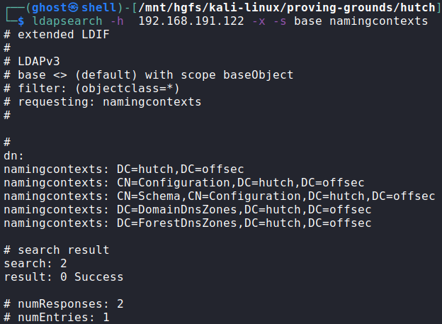

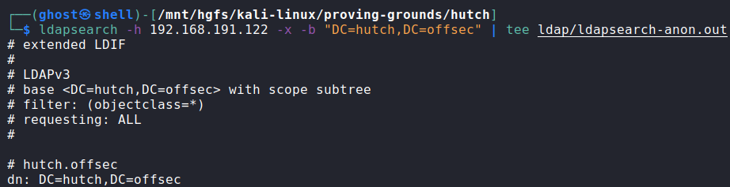

🔑 Found user credentials in LDAP results `fmcsorley:CrabSharkJellyfish192`.\
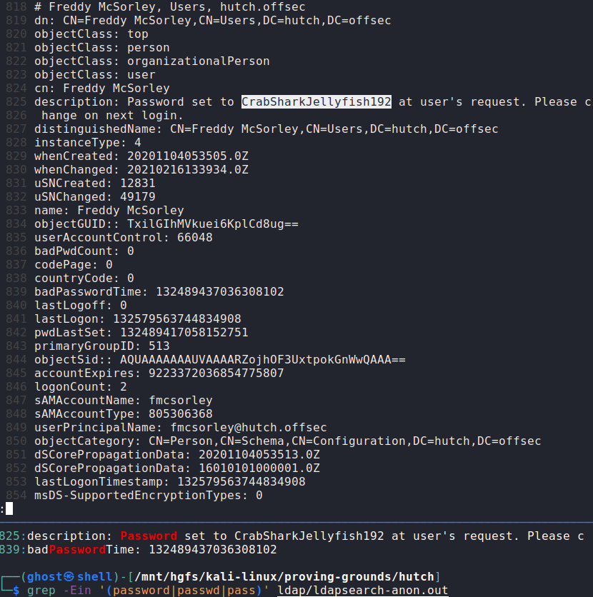

🔎 Checking SMB shares for fmcsorley but only the default ones are available.\
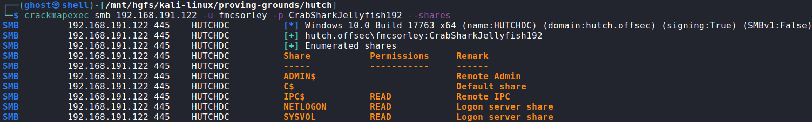

🔎 Testing if fmcsorley have access to the WebDav console.\
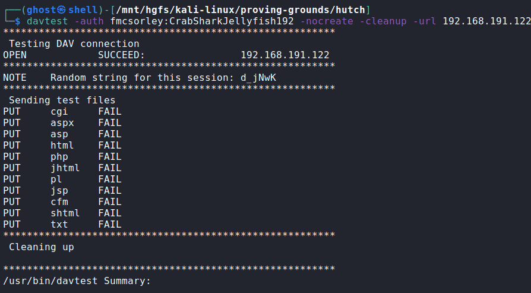

💀 Although all checks fail, it is possible to upload files via WebDav.
Uploading an ASPX reverse shell[^1] to get access as
iis apppool\\defaultapppool.\
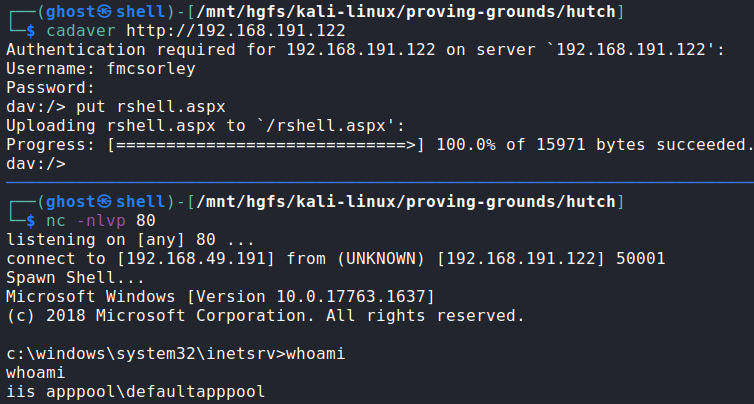

🏳 User flag.\
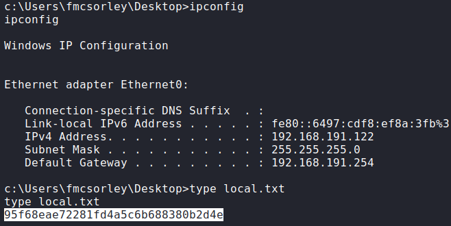

🔎 General system information.

🔎 The `SeImpersonatePrivilege` privilege indicates that is possible to escalate
privileges by abusing tokens (not tested).\
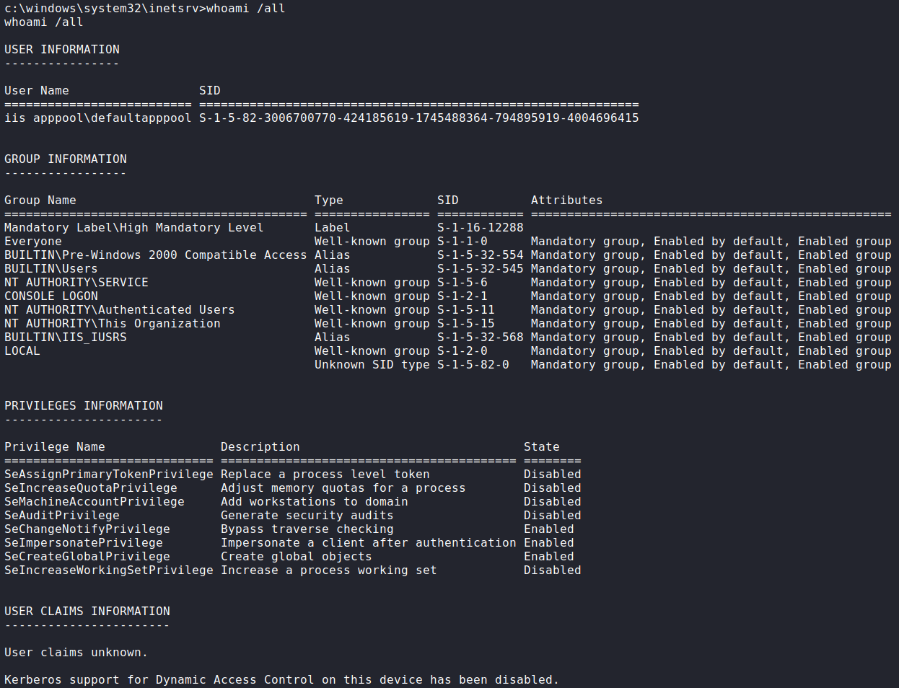

🔎 Notice that LAPS is installed in the system.\
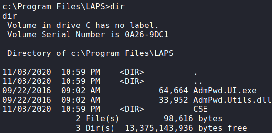

🔑 Dumping LAPS creds[^2] and revealing the Administrator password
`/hIx4.zja;/r$B`.\
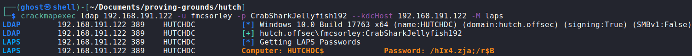

🔎 Using port 5985 (WinRM) to access with Administrator credentials.\
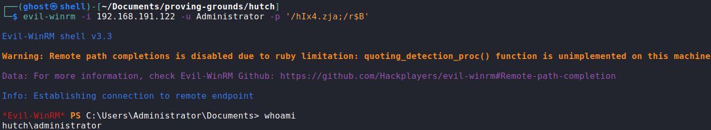

🏴 Administrator flag.\

### References
[^1]: https://www.darknet.org.uk/2014/12/insomniashell-asp-net-reverse-shell-bind-shell
[^2]: https://www.hackingarticles.in/credential-dumpinglaps/