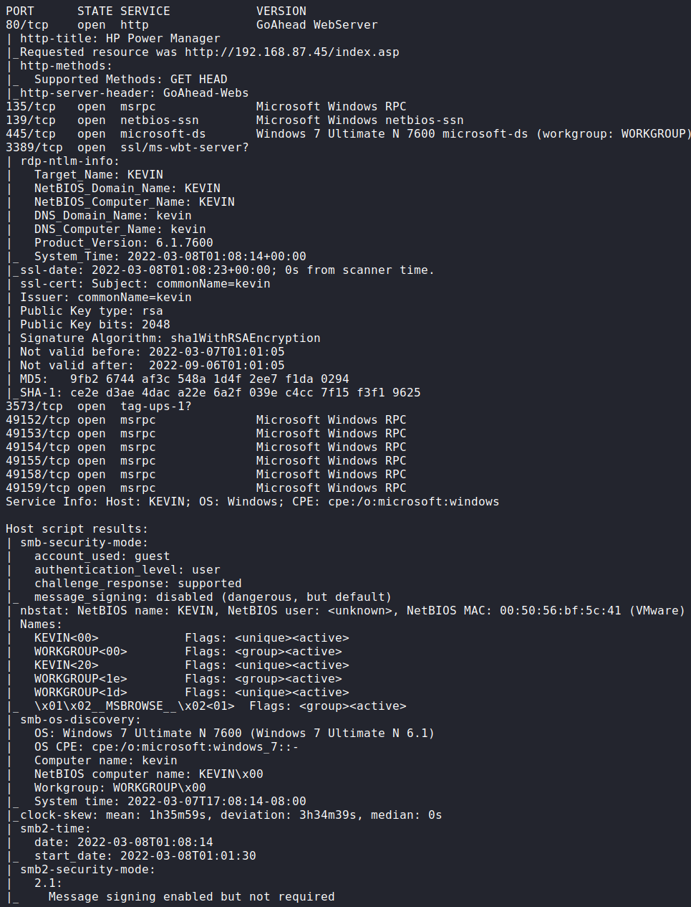
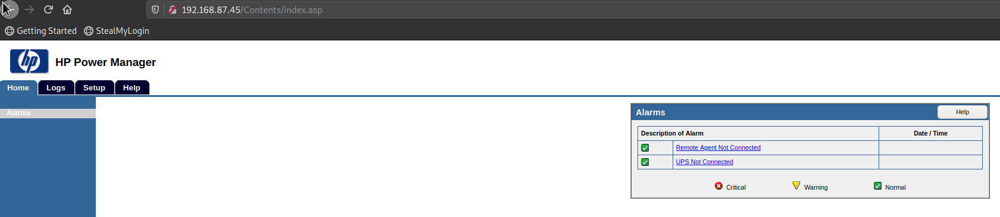
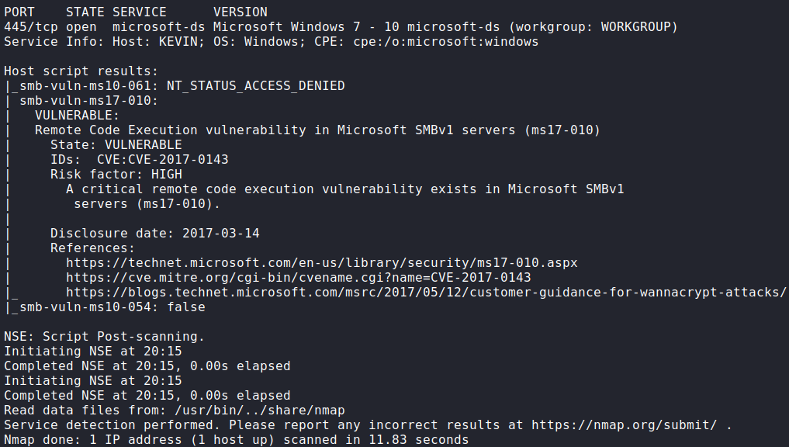
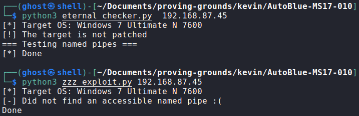
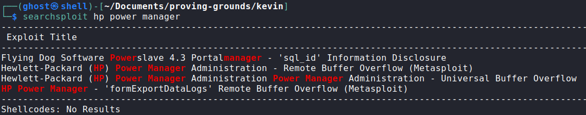
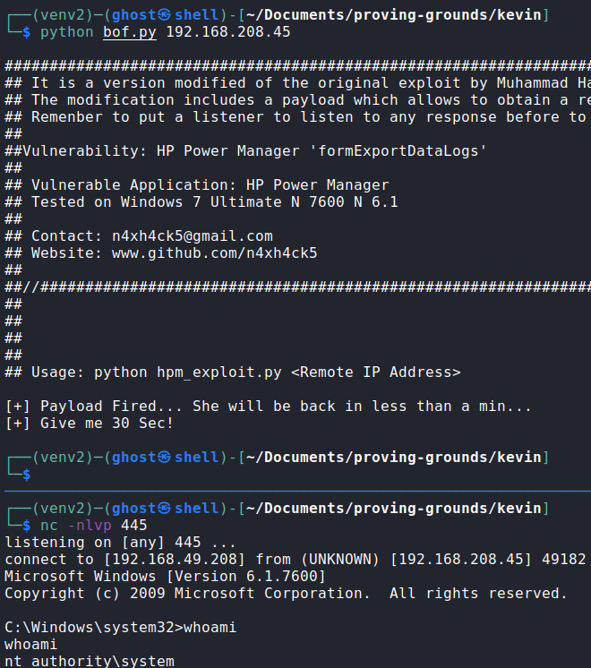
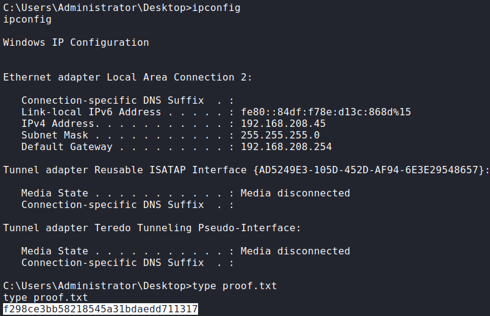

# Kevin

### Port Scan

## Procedure
🔎 Port 80 is running a web server hosting HP Power Manager 4.2 (Build 7).\

🔎 Port 445 appears to be vulnerable to CVE-2017-0144 (MS17-10 EternalBlue).\

🔎 Couldn't execute the exploit[^1], seems that there isn't an available named
pipe for anonymous sessions.\

🔎 HP Power Manager is vulnerable to Buffer Overflow (CVE-2009-2685).\

💀 Exploit CVE-2009-2685[^2] to gain access as System.\

🏴 Administrator flag.\

### References
[^1]: https://github.com/3ndG4me/AutoBlue-MS17-010
[^2]: https://www.exploit-db.com/exploits/10099