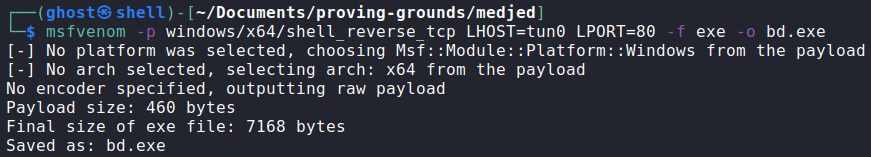

# Medjed

### Port Scan

## Procedure
🔑 Port 8000 contains an unfinished configuration wizard for barracudadrive 6.5.
Created an Administrator account.\

🔎 This version of BarracudaDrive appears to be vulnerable to Privilege
Escalation.\

🔎 BarracudaDrive enables WebDAV with `r/w` access rights.\

🔎 Access WebDAV with the account previously created.\

🔎 Found XAMPP installation serving a web page on port 45332, which allows to
access files in the web server root.\

💀 Uploaded a reverse shell[^2] to `htdocs` using WebDAV and executed it through
the web server to get access as medjed/jerren.\

🏳 User flag.\

🔎 System information.\

💀 Generating and uploading a reverse shell to exploit the PrivEsc[^1]
identified earlier. Followed the steps, and after reboot received a connection
from the machine as System.\

🏴 Administrator flag.\

### References
[^1]: https://www.exploit-db.com/exploits/48789
[^2]: https://github.com/ivan-sincek/php-reverse-shell