# Slort

### Port Scan
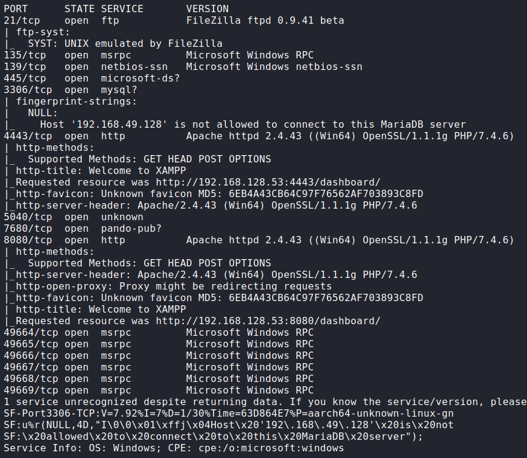

## Procedure
🔎 Ports 21 (ftp) and 445 (smb) don't allow anonymous connections.\
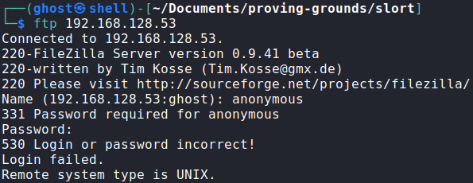

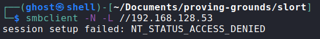

🔎 Ports 4443 and 8080 are running an instance of XAMPP.\

🔎 The contents of `phpinfo.php` are exposed.\
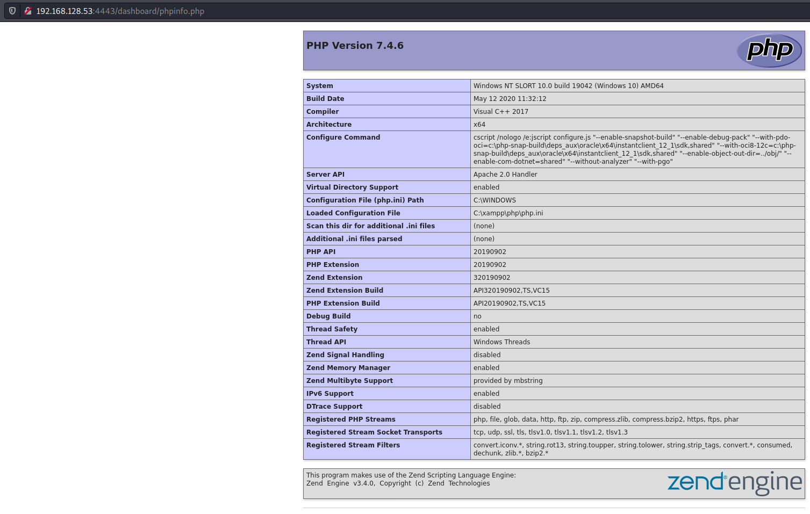

🔎 Found some interesting folders using FFUF.\
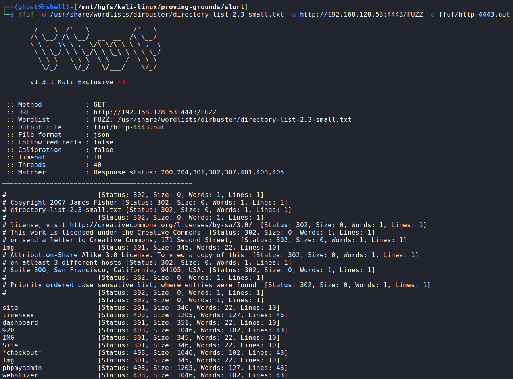

🔎 The resource `/site` redirects to a website.\
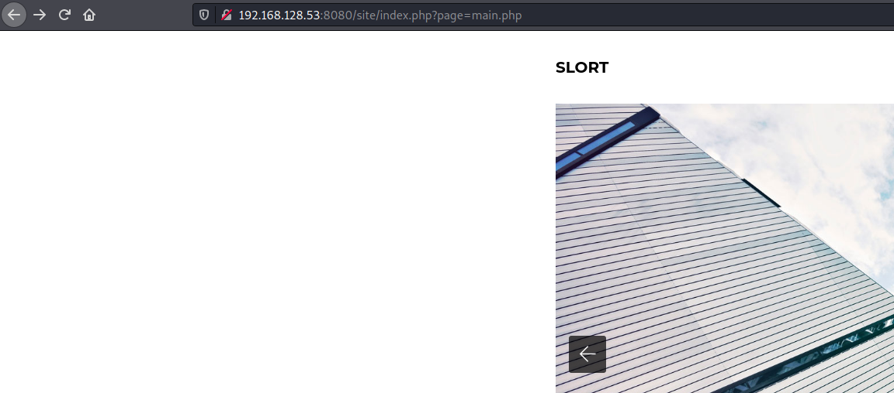

🔎 Seems vulnerable to Local File Inclusion (LFI).\
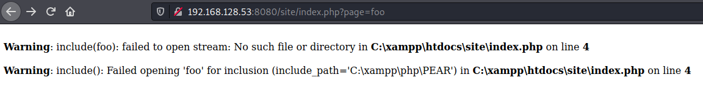

🔎 And Remote File Inclusion (RFI) as well.\
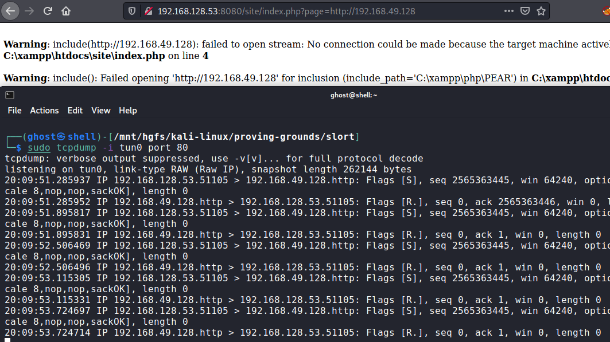

💀 Execute a PHP reverse shell[^1] hosted with Python to get access as rupert.\
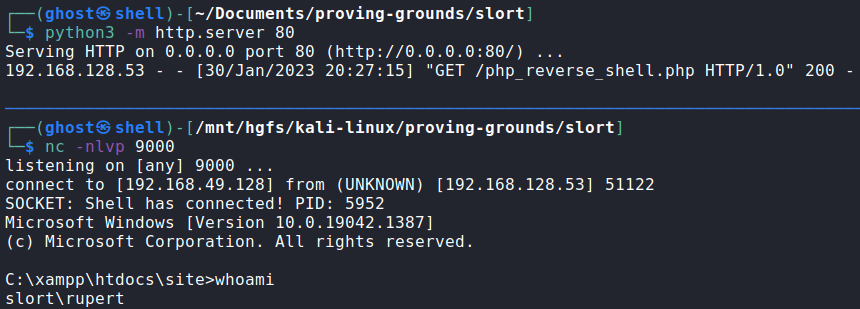

🏳 User flag.\
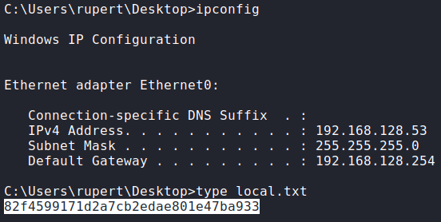

🔎 User information.\
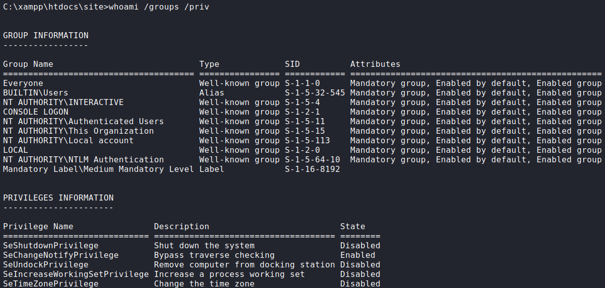

🔎 System information.\
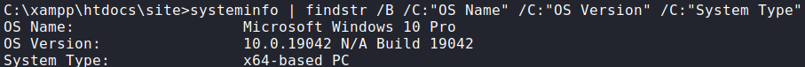

🔎 In `C:\Backup` there's a file indicating that `TFTP.EXE` is running every 5
minutes.\
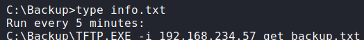

🔎 Checking file permissions shows that the user has full access.\
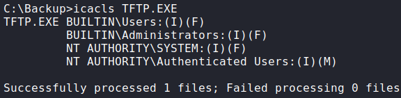

💀 Replaced the `TFTP.EXE` file with a reverse shell generated with MSF to get
access as System.\
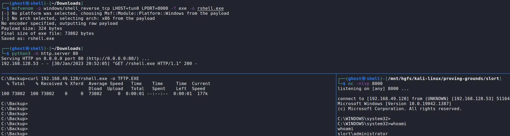

🏴 Administrator flag.\
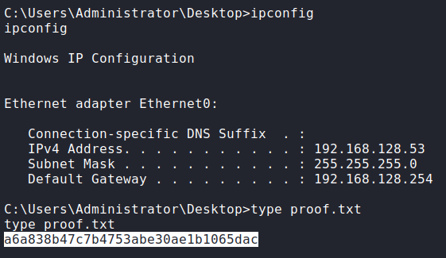

### References
[^1]: https://github.com/ivan-sincek/php-reverse-shell