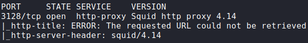
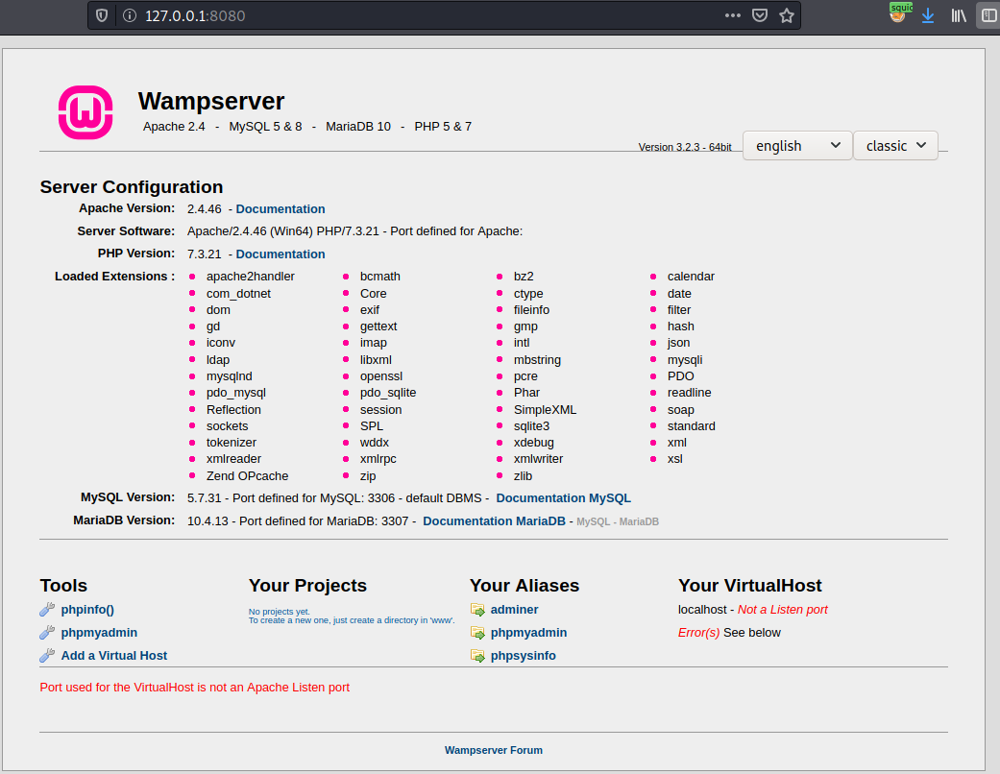
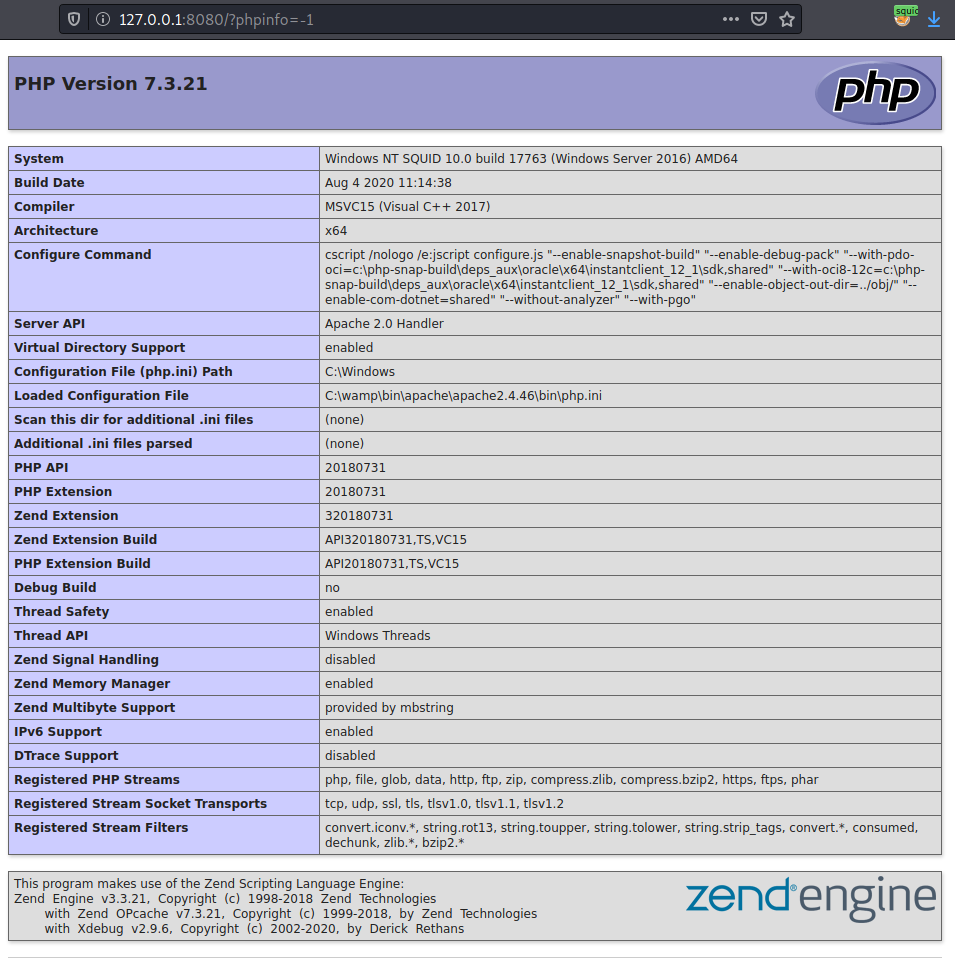
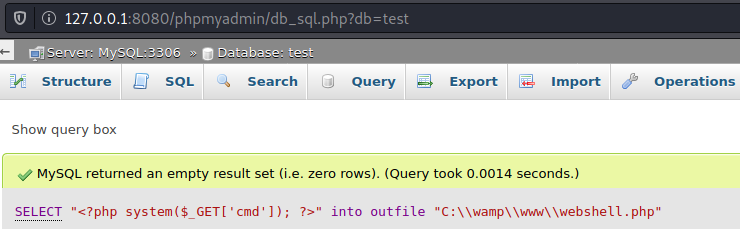
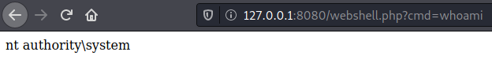
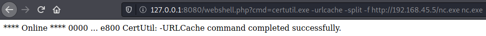
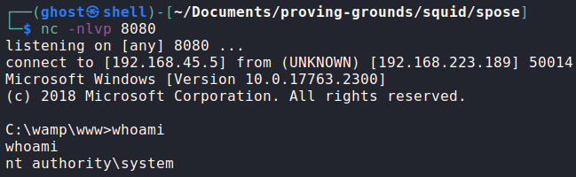
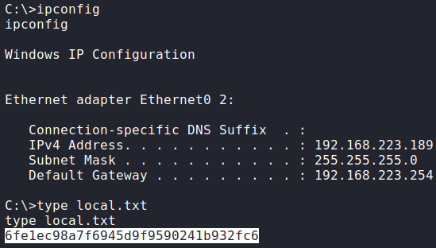
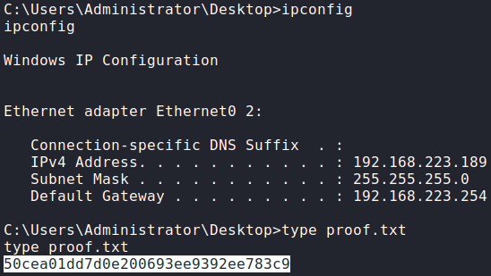

# Squid

### Port Scan

## Procedure
🔎 Scan results shows a `http-proxy` running on port 3128. Checking additional
ports on localhost using Spose[^1] through the proxy.\

🔎 Accessing port 8080 on localhost by configuring FoxyProxy[^2] to use the
server's proxy. Found `Wampsever` instance.\

🔎 The `phpinfo` page and **phpMyAdmin** console are exposed.\

🔑 Accessing **phpMyAdmin** default credentials `root:[no pass]`.\

💀 Executing a query to generate a web shell in `C:/wamp/www`[^3].\

🔎 Running commands in the machine as System.\

🔎 Uploaded a Net Cat binary and spawned a reverse shell as System.\

🏳 User flag.\

🏴 Administrator flag.\

### References
[^1]: https://github.com/aancw/spose
[^2]: https://getfoxyproxy.org/
[^3]: https://www.hackingarticles.in/shell-uploading-web-server-phpmyadmin/